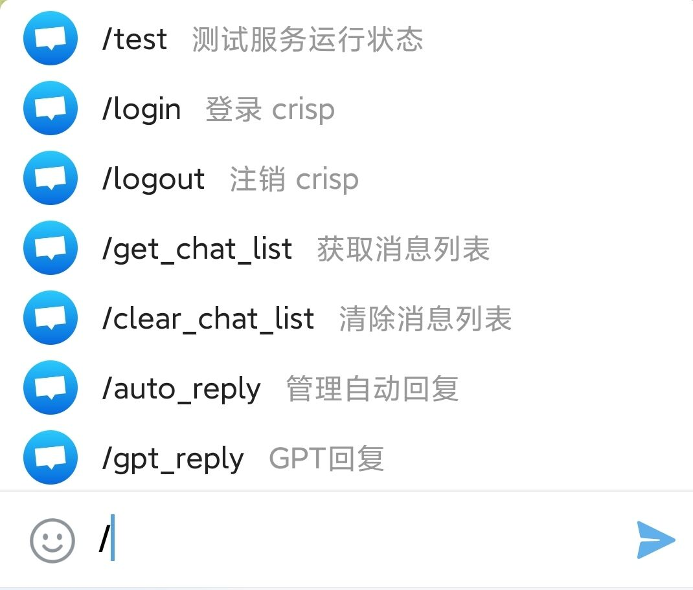

# 关于 crisp bot
- 能多账号登录 同时运行管理，登录能随时切换
- 支持群内回复和机器人聊天回复
- 能在线编辑回复规则智能自动回复
- 程序停止 重新运行时能获取未转发的消息转发
- 

# 安装docker
```
curl -sSL https://get.docker.com | bash
```

# 获取项目文件
```
git clone https://github.com/yidaplus/crisp_tgbot.git
cd crisp_tgbot
```

# 修改配置文件
修改 docker-compose.yaml 里面的配置项


# 运行程序
```
docker compose up -d
```

# 其他
列出所有容器
```
docker ps -a
```
查看容器日志
```
docker logs [容器名称或ID]
```